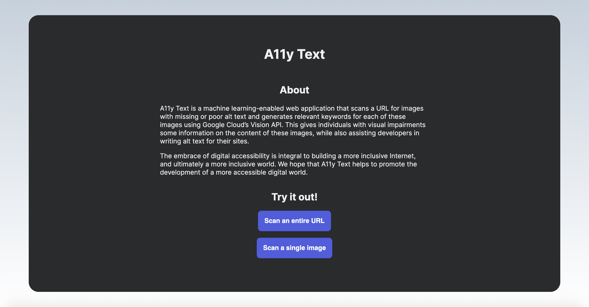

# A11y Text

A11y Text promotes the development of a more accessible digital world. Using Google Cloud’s Vision API, our web app generates relevant keywords for missing or poor alt text on images.

We used Python, HTML, CSS, JavaScript, Google Cloud Vision API, Google Cloud Storage, and Google Cloud Firestone to build the project.

## Inspiration:

In an increasingly digital world where the Internet influences essential parts of our everyday lives, from the way we communicate with friends and family members to how we apply for health insurance, it is essential that web accessibility is prioritized. Yet, according to WebAIM’s 2020 accessibility analysis, 98.1% of home pages of the top 1 million websites had detectable accessibility issues. WebAIM estimates that “users with disabilities would expect to encounter detectable errors on 1 in every 14 home page elements with which they engage,” which means that they may be excluded from the information and services that these websites offer.

The same analysis reveals that missing alternative text (alt text) for images was the second most common failure on home pages. What happens if an image link breaks? Or if an individual is using a screen reader? Or if a browser can’t load an image? The presence of alt text not only improves the user experience for all users but also is essential for individuals with visual impairments.

We created A11y Text, a machine learning-enabled web application that scans a URL for images with missing or poor alt text and generates relevant keywords for each of these images using Google Cloud’s Vision API. This gives individuals with visual impairments some information on the content of these images, while also assisting developers in writing alt text for their sites.

The embrace of digital accessibility is integral to building a more inclusive Internet, and ultimately a more inclusive world. We hope that A11y Text helps to promote the development of a more accessible digital world.

## Screenshot

